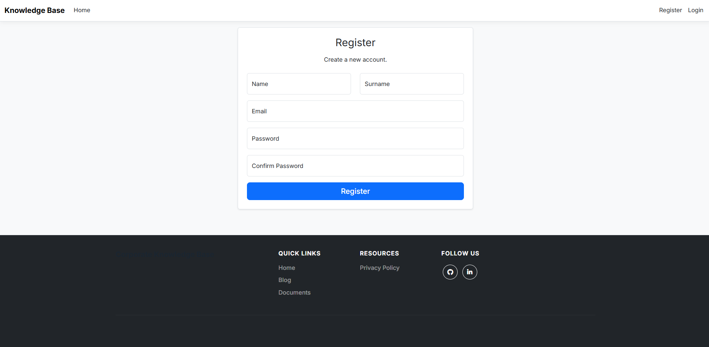
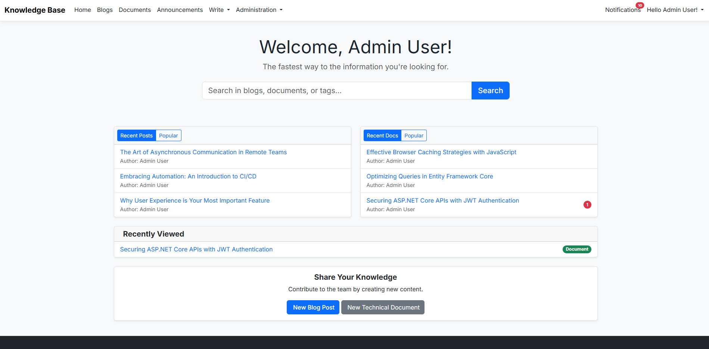
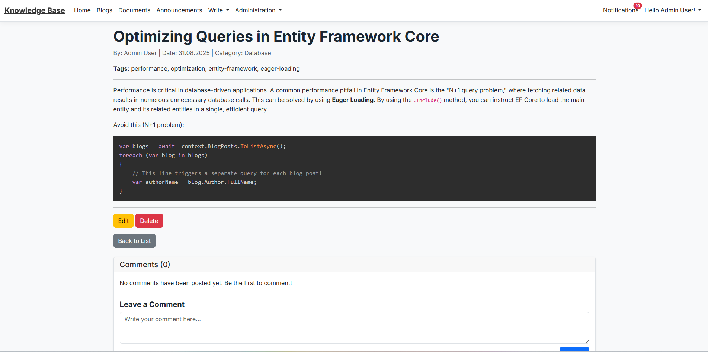
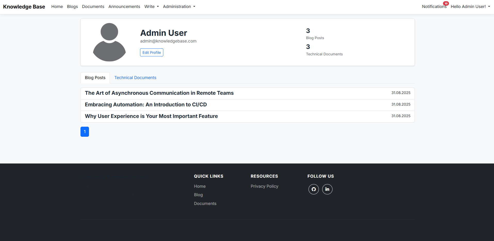
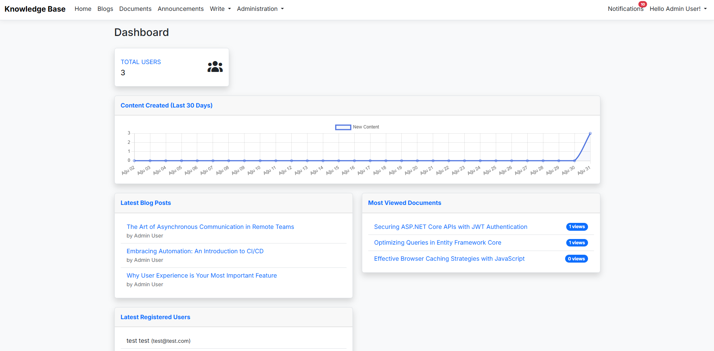

# Corporate Knowledge Base

   

## Project Description

This project is a **Corporate Knowledge Base** platform developed to centralize and facilitate internal knowledge sharing within a company. Its purpose is to enable employees to share their knowledge and experience through blog posts, technical documents, and announcements. This helps to accelerate the onboarding process for new staff and to prevent the loss of institutional knowledge when experienced employees leave the company.

---

## 📸 Screenshots

| Login Page | Register Page |
| :---: | :---: |
|  |  |
| **Logged-in Dashboard** | **Article Detail & Comments** |
|  |  |
| **User Profile** | **Admin Panel (Dashboard)** |
|  |  |


---

## ✨ Features

-   **Content Management:** Full CRUD operations for blog posts, technical documents, and announcements.
-   **Advanced Editor:** A rich Markdown writing experience for all content types using the `EasyMDE` library.
-   **Unified Search:** A single interface to search across blogs, documents, and announcements without a page reload (AJAX).
-   **Role-Based Access Control:** Detailed authorization with three distinct user roles: `Admin`, `Developer`, and `Employee`.
-   **Comprehensive Admin Panel:** A dashboard with data visualization charts; dedicated pages for managing users, roles, tags, and categories.
-   **Smart Notification Center:** Customizable, real-time notifications for new content and comments, with a central page to manage all notifications.
-   **In-Place Editing:** The ability to instantly edit content from the details page without navigating to a separate edit form.
-   **Dynamic Interface with AJAX:** Filtering, pagination, and comment submission are handled via AJAX, preventing full page reloads.
-   **Intelligent Tag Management:** A modern tagging interface powered by `Tagify.js` and a feature in the admin panel to merge duplicate tags.
-   **Syntax Highlighting:** Syntax highlighting for code blocks in technical documents using `Prism.js`.
-   **Comprehensive User Profiles:** Paginated lists of personal content, profile picture uploads, and notification settings management.

---

## 🚀 Tech Stack

**Backend:**
-   ASP.NET Core 9.0 (MVC)
-   C# 13.0
-   Entity Framework Core 9.0
-   ASP.NET Core Identity
-   **Markdig:** A Markdown to HTML converter.

**Frontend:**
-   HTML5, CSS3 (with CSS Variables), JavaScript
-   Bootstrap 5
-   jQuery
-   **Toastr.js:** For instant user notifications.
-   **Tagify.js:** For an interactive tagging interface.
-   **EasyMDE:** For the rich Markdown editor.
-   **Prism.js:** For syntax highlighting in code blocks.
-   **Chart.js:** For the data visualization chart in the admin dashboard.

**Database:**
-   MS SQL Server 2022

---

## 🏗️ Architecture & Design Notes

-   **Service Layer Architecture:** Business logic is separated from the Controller layer using service classes like `NotificationService`.
-   **Data Seeding:** On the application's first run, the database is automatically seeded with necessary roles, an admin user, and initial categories (`Program.cs`).
-   **Performance Optimization:** Frequently accessed data, such as the category list, is cached in memory using `IMemoryCache`. The cache is intelligently cleared when the underlying data changes (Cache Invalidation).
-   **Security:** Authorization is built on ASP.NET Core Identity's role-based mechanism. For critical operations like editing/deleting, the system checks for content ownership in addition to the user's role.
-   **Data Integrity:** Deletion of in-use categories is prevented. When editing tags, those with the same name are intelligently merged. Cascading deletes are intentionally disabled in the database to ensure data consistency.

---

## ⚙️ Installation

1.  **Clone the Repository:**
    git clone [https://github.com/umitkrkmz/CorporateKnowledgeBase.git](https://github.com/umitkrkmz/CorporateKnowledgeBase.git)
2.  **Navigate to the Project Directory:**
    Navigate to the root directory where the `CorporateKnowledgeBase.sln` file is located.
3.  **Configure Appsettings and Secrets:**
    * Modify the `ConnectionStrings` section in the `appsettings.json` file to point to your MS SQL Server instance.
    * Add a password for the default admin user to the project's User Secrets (`secrets.json`):
        ```json
        {
          "AdminUser:Password": "EnterAStrongPasswordHere"
        }
        ```
4.  **Database Migrations:**
    Run the following command from the Package Manager Console to create the database. The seeding mechanism in `Program.cs` will handle the rest.
    ```powershell
    Update-Database
    ```
5.  **Run the Application:**
    * Start the project from Visual Studio 2022 (v17.14 or later) or by using the `dotnet run` command.
    * You can log in with the default admin user:
        * **Email:** `admin@knowledgebase.com`
        * **Password:** The password you set in the `secrets.json` file.

---

## 📄 License

Copyright (c) 2025 umitkrkmz

This project is licensed under the **MIT License**. For the full text of the license, please see the `LICENSE` file.
